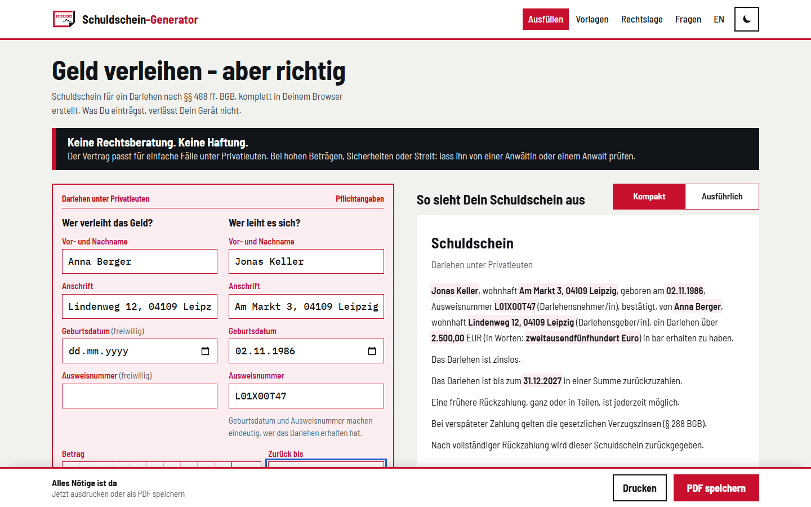
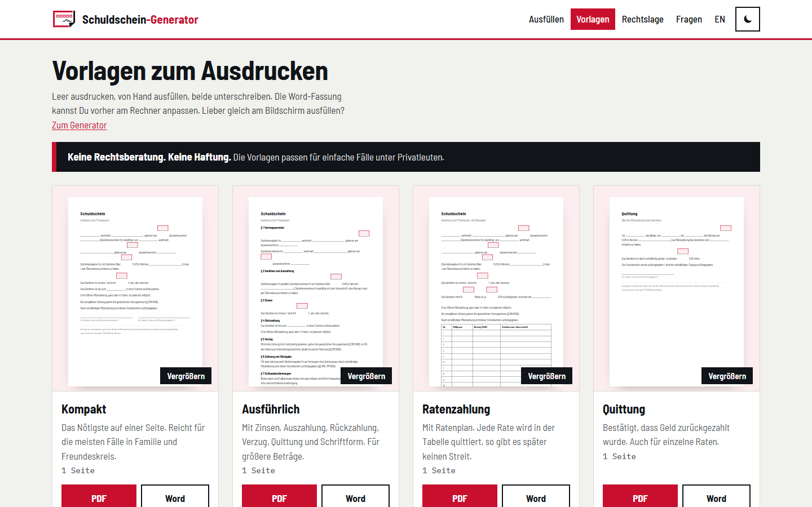
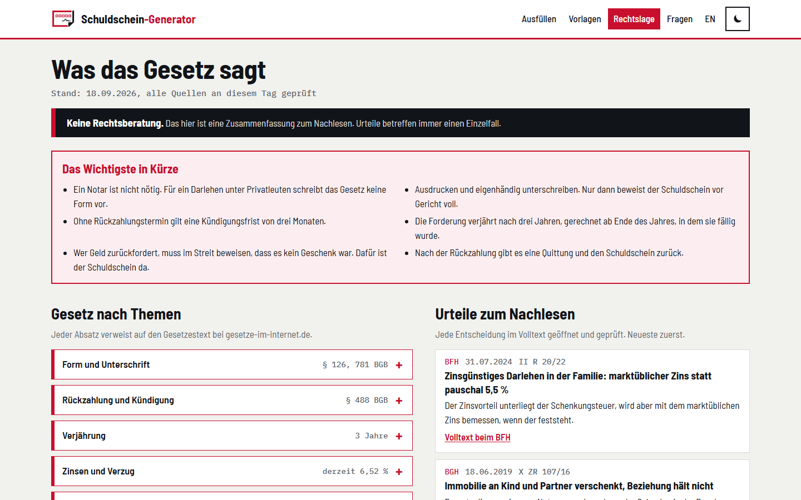

# Schuldschein-Generator

<p align="center">
   <b>English</b> ·
   <a href="README.de.md">Deutsch</a>
</p>

---

[](LICENSE)
[](https://astro.build/)
[](https://github.com/michaelblaess/schuldschein-generator/commits/main)

Lend money, the right way: a promissory note under German law, filled in on one page, saved as a PDF or printed. Free, no sign-up, and nothing you enter leaves the browser.

Live at **[schuldschein-generator.de](https://schuldschein-generator.de)**, in German and English.



## Disclaimer

**This is not legal advice.** The generator, the templates and the summary of the law are meant for simple loans between private individuals. Whether a document is valid and suitable in a particular case can only be judged by a lawyer. The software is provided as is, without any warranty, see [LICENSE](LICENSE). Use at your own risk.

## What it does

- **One page, no wizard.** The required details sit on a slip styled after a German bank transfer form, one block per person. For the borrower, date of birth and ID number are required so that it is clear who received the money. Interest, instalments, bank accounts, purpose and witness fold out only when needed, and each strip shows its state even when closed.
- **Live preview** of the promissory note, short or detailed version, with the amount in words (German and English, cents included).
- **PDF and print** straight from the browser. The PDF contains real text and real signature lines.
- **Templates** on their own page: short, detailed, instalments and receipt, as PDF and Word, with a preview.
- **The law**: statutes by topic and 12 court decisions, each checked in full on 18.09.2026, with case numbers and links.
- **FAQ** with the legal basis for every answer, also as structured data.
- **Light and dark**, follows the system until you choose.
- **Privacy by construction:** entries are only stored if you tick "remember", the theme only after you click the switch, the language lives in the URL. Google Analytics is only built in with a measurement id and only loads after consent.

## Screenshots

| Templates | The law | Mobile, dark |
| --- | --- | --- |
|  |  |  |

## Tech

Astro 7 (static), Tailwind 4, TypeScript. `pdf-lib` for the PDF, `docx` for the Word templates, `vanilla-cookieconsent` for the consent banner. Fonts are self-hosted via Fontsource (Barlow Semi Condensed, IBM Plex Mono).

The contract text has exactly one source, `src/lib/vertrag.ts`. Preview, print, PDF, Word and the blank templates are all built from it, so they cannot drift apart.

```
src/
  lib/          contract text, amount in words, dates (§ 188 BGB), IBAN, instalments, PDF, Word, legal texts
  components/   generator, templates, law, FAQ, header, footer
  pages/        German at /, English at /en/, templates as PDF and DOCX at build time
  scripts/      the generator in the browser
tests/          vitest for the pure functions
tools/          smoke test, accessibility check, icon and share image generator
docs/           design drafts, code review of the old version, legal research
```

## Development

```bash
npm install
npm run dev          # http://localhost:4321
npm test             # 48 unit tests
npm run pruefen      # tests, build, launch gate, browser smoke test, accessibility
```

`npm run pruefen` needs a Playwright Chromium in `~/AppData/Local/ms-playwright`. Analytics stays off unless the build runs with `PUBLIC_GA_ID`.

## Deployment

GitHub Actions builds the site and uploads `dist/` via FTPS to the web space. The workflow is started by hand for now (`workflow_dispatch`) and needs the repository secrets `FTP_HOST`, `FTP_USER` and `FTP_PASSWORD`. Redirects and caching live in `public/.htaccess`.

## License

[Apache 2.0](LICENSE). Third-party licences in [NOTICE](NOTICE).
